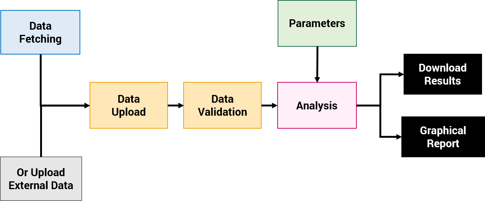

# SBS BI Documentation

The SBS BI web app was designed to analyze (big) textual data, in order to calculate the <a href="https://semanticbrandscore.com" target="_blank">**Semantic Brand Score**</a> and produce a wide set of **brand intelligence analytics**.

## Main Functionalities

- [**Fetch**](fetch.md): collect textual data from multiple sources, such as Twitter or EventRegistry.
- [**Input**](upload.md): upload the corpus that will be analyzed (can be any textual data) and validate it.
- [**Parameters**](param.md): set the parameters for the analysis.
- [**Analysis**](analysis.md): run the analysis and obtain results and reports.
- [**Extra**](extra.md): run additional analyses that complement the main reports.

The most typical app flow diagram is presented here:

{: style="width:600px"}

## App Demo
Available at <a href="https://bi.semanticbrandscore.com" target="_blank">**bi.semanticbrandscore.com**</a>.  
Please contact us to request an access for research purposes.

## References

<a href="https://semanticbrandscore.com/articles/sbsarticles.html" target="_blank">**Click here**</a> to see the main references regarding the Semantic Brand Score, this web app, tutorials and other related materials.
